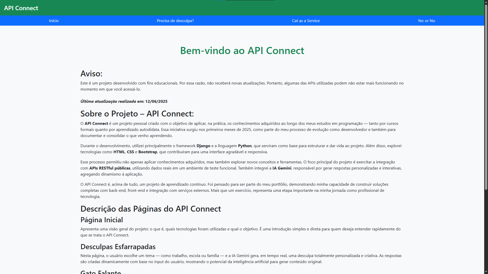
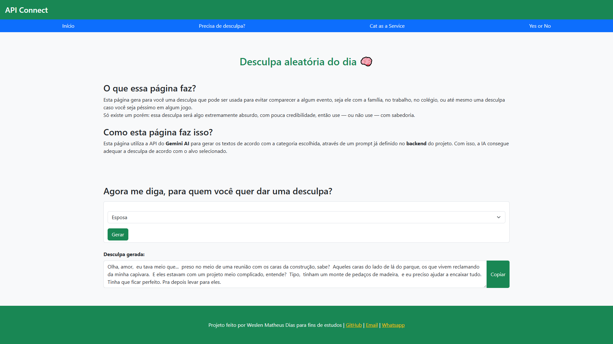
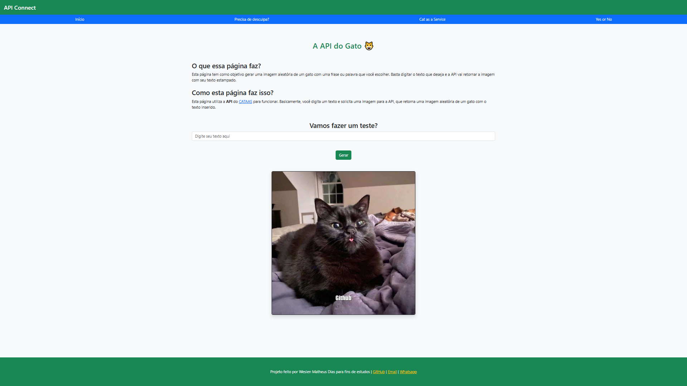
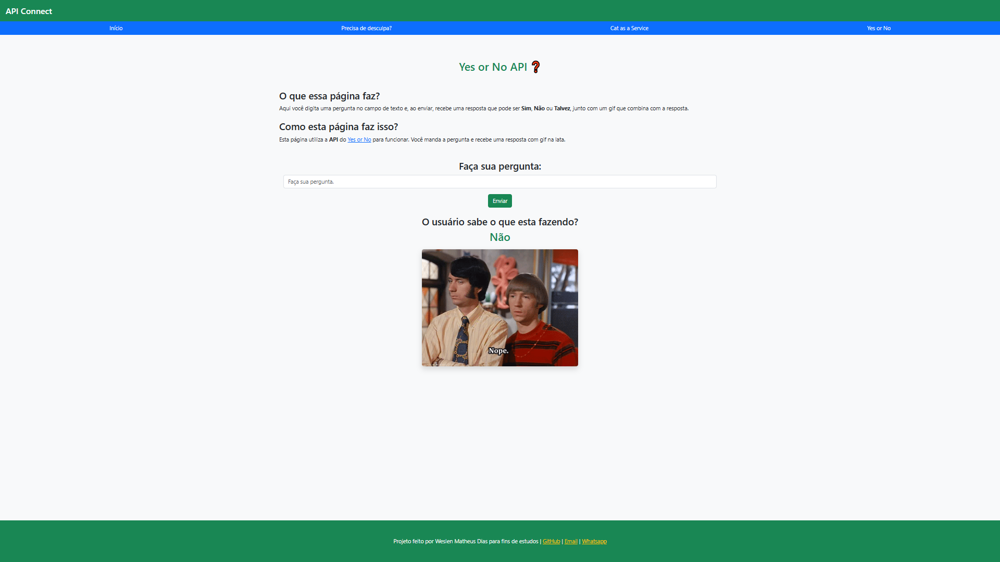

# Projeto: APIConnect

# O que é?
Um site web feito com Django e Python, onde o objetivo é a implementação e consumo de API's RESTful:

# O que faz?

- A página de desculpas utiliza a api do Gemini para criar uma desculpa aleatória de acordo com a vontade do usuário.
- A página da API Cat as a Service, retorna uma imagem de gato com uma palavra ou frase escrita pelo usuário.
- A página Yes or No responde a uma pergunta do usuário com Sim, Não ou Talvez e retorna um gif de acordo com a resposta.

Feito pra zoar, treinar Django, e mostrar que dá pra programar rindo.  
**Porque se não for pra ser doido, nem começo.**

## 🚀 Tecnologias Usadas

- Python 3.12  
- Django 5  
- HTML + CSS  
- Bootstrap  
- API Gemini (Google)  
- JavaScript básico  
- Git e GitHub  
- API Cat as a Service
- API Yes or No

## 💻 Como rodar localmente

1. Clona o repositório:

```bash
git clone https://github.com/wesmth/connect
cd connect
```

2. Cria e ativa um ambiente virtual:

```bash
python -m venv venv
source venv/bin/activate  # Linux/macOS
venv\Scripts\activate     # Windows
```

3. Instala as dependências:

```bash
pip install -r requirements.txt
```

4. Cria um arquivo `.env` na raiz com isso aqui:

```env
GOOGLE_API_KEY=your-google-gemini-api-key
```

5. Roda o servidor Django:

```bash
python manage.py runserver
```

Depois abre o link que irá aparecer no terminal em seu navegador.  

## 🧠 O que aprendi nesse projeto

- Criar views, templates e urls com Django
- Usar API externa (Gemini e Excuser)
- Trabalhar com variáveis de ambiente
- Usar Bootstrap para criar a aparência do site
- Git e GitHub


## 🖼 Prints








## 📫 Fala comigo!

- 📧 weslen@email.com  
- 📱 [WhatsApp](https://wa.me/5541991278171)

## ⚠️ Aviso

- Esse site é para estudos e descontração.
- Projeto feito pra praticar e dar risada.
- Pode usar como base, só não seja pau no c* e dá os créditos ✌️

## ⭐ Curtiu?

Então dá uma ⭐ no repositório.  
